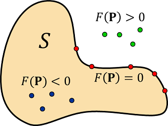

# nTop Core: an Implicit Interop Library

## Introduction

This document describes a library of functions called nTop Core. You can use these functions to derive information from implicit bodies exported from nTop, which can then be used in your own applications. In this way, you achieve interoperability between nTop and your application.

## Implicit Bodies

The functions in nTop Core let you work with **implicit bodies** created in nTop. An implicit body is defined by a function *F* called its **field**. Given an implicit body **S**, and a 3D point **P**, the value *F*(**P**) provides a rough measure of the distance from **P** to the boundary of **S**, with *F*(**P**) < 0 when **P** is inside the body, and *F*(**P**) > 0 for points outside.

One of the functions in nTop Core computes *F*(**P**) at any given point **P**. By calling this function, you can decide which points are inside the body and which are outside, allowing you to implement a variety of applications. For example, you can compute the volume of the body, tessellate it, or slice it for additive manufacturing.

The library operates in units of **meters** so when making queries against a `.implicit` be sure to convert from your native units.

## Why a Library?

A more traditional approach to data interoperability is to have nTop export its models in some standard format that other applications can read. Typical export formats are polygonal meshes, voxel structures, boundary representations (b-reps), and planar slices. nTop has numerous data export functions to support this approach, but it does not work well for certain types of models. Some specific problems are:

- Meshes, voxels, and slices are approximations with a "baked-in" error.
- Meshes are extremely large, especially if they are accurate.
- Exported meshes and b-reps are "dumb" and difficult to edit.

We created nTop Core to address these problems: it allows you to work with highly accurate representations that occupy very little space.

## The Basic Idea

The basic flow is shown in the following diagram:

The important steps are:

1. The nTop user exports a `.implicit` file containing a representation of an implicit body.
2. The functions in nTop Core interact with the `.implicit` file.
3. Your code calls functions in nTop Core to get information about the implicit body.

Each of these steps is explained in more detail below.

## Exporting a `.implicit` file

There is a block in nTop called "Export Implicit Body" that allows you to export a representation of an implicit body from within an nTop notebook. However, for the purpose of developing your application, it is not absolutely necessary to go through this export step, as we provide some simple `.implicit` files that you can use for initial testing.

## Calling nTop Core Functions

We supply nTop Core as a standard Windows DLL that exports a small set of C functions. These functions use very simple arguments to make them more easily callable from various different programming languages. You are free to choose any language for your application. The functions use the `cdecl` calling convention, as specified in the `ntop_core.h` header file. We provide examples showing simple methods of calling nTop Core functions from C++, C#, and Python.

Specifically, nTop Core provides the capability to:

- Load an implicit body from a `.implicit` file.
- Perform rigid transformations on an implicit body
- Scale an implicit body.
- Evaluate the body's field at a given point, as described above
- Evaluate the gradient of the body's field function
- Compute intervals
- Compute closest point on body's surface
- Slice an implicit body with a plane using dual contouring or the marching squares algorithm.
- Save an implicit body to a `.implicit` file.
- Get the nTop Core library version

These functions are described in detail in the `ntop_core.h` header file, using Doxygen-style comments.

## nTop Core Dependencies

nTop Core requires the following dependencies:

- Visual Studio 2019 C++ Redistributable ([link](https://learn.microsoft.com/en-us/cpp/windows/latest-supported-vc-redist?view=msvc-170#visual-studio-2015-2017-2019-and-2022/))

## Examples

The [examples](examples) folder contains several examples showing how to call nTop Core functions in C++, C# (dotnet 7), and Python 3.
